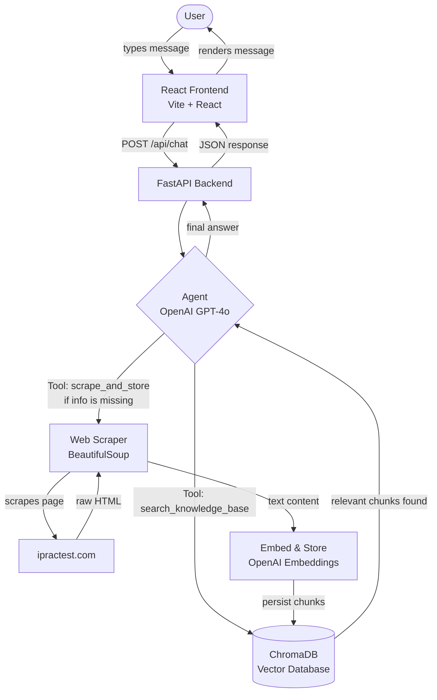

# iPractest AI Chatbot

An AI-powered chatbot for [ipractest.com](https://ipractest.com) — an IELTS preparation platform. The bot answers user questions by searching a local vector database, and automatically scrapes missing information from the website when needed.

---

## Architecture



---

## Project Structure

```
AgentBot/
├── backend/
│   ├── main.py            ← FastAPI server (POST /chat, GET /health)
│   ├── agent.py           ← OpenAI GPT-4o agent with tool calling
│   ├── vector_store.py    ← ChromaDB operations (add, search, check)
│   ├── scraper.py         ← BeautifulSoup web scraper
│   ├── seed_data.py       ← One-time script to pre-load iPractest pages
│   ├── .env.example       ← Environment variable template
│   └── requirements.txt   ← Python dependencies
└── frontend/
    ├── src/
    │   ├── main.jsx
    │   ├── App.jsx
    │   ├── App.css
    │   └── components/
    │       └── Chat.jsx   ← Chat UI component
    ├── index.html
    ├── package.json
    └── vite.config.js     ← Proxy /api → localhost:8000
```

---

## How It Works

1. **User** sends a message via the React chat UI
2. **FastAPI** receives the request and passes it to the agent
3. **Agent** (GPT-4o) always calls `search_knowledge_base` first
4. If relevant content is found in **ChromaDB** → answers immediately
5. If content is missing → calls `scrape_and_store` to fetch the relevant `ipractest.com` page, chunk it, embed it, and store it
6. The agent answers using the freshly retrieved content
7. Next time the same topic is asked → already in the DB, no scraping needed

---

## Setup & Installation

### Prerequisites

- Python 3.10+
- Node.js 18+
- OpenAI API key

---

### Backend

```bash
cd backend

# 1. Create environment file
cp .env.example .env
# Edit .env and add your OpenAI API key:
# OPENAI_API_KEY=sk-...

# 2. Install dependencies
pip install -r requirements.txt

# 3. Pre-load iPractest.com into the vector DB (run once)
python seed_data.py

# 4. Start the API server
uvicorn main:app --reload --port 8000
```

Server runs at: `http://localhost:8000`

---

### Frontend

```bash
cd frontend

# 1. Install dependencies
npm install

# 2. Start the dev server
npm run dev
```

App runs at: `http://localhost:5173`

---

## API

### `POST /chat`

```json
// Request
{
  "message": "What practice tests does iPractest offer?",
  "history": [
    { "role": "user", "content": "Hello" },
    { "role": "assistant", "content": "Hi! How can I help?" }
  ]
}

// Response
{
  "response": "iPractest offers practice tests for all four IELTS components..."
}
```

### `GET /health`

```json
{ "status": "ok" }
```

---

## Tech Stack

| Layer        | Technology                        |
|-------------|-----------------------------------|
| Frontend     | React 18, Vite                   |
| Backend      | FastAPI, Python                  |
| LLM          | OpenAI GPT-4o                    |
| Vector DB    | ChromaDB (local, persisted)      |
| Embeddings   | OpenAI text-embedding-3-small    |
| Scraping     | BeautifulSoup4, Requests         |
| Agent Tools  | OpenAI Function Calling          |
